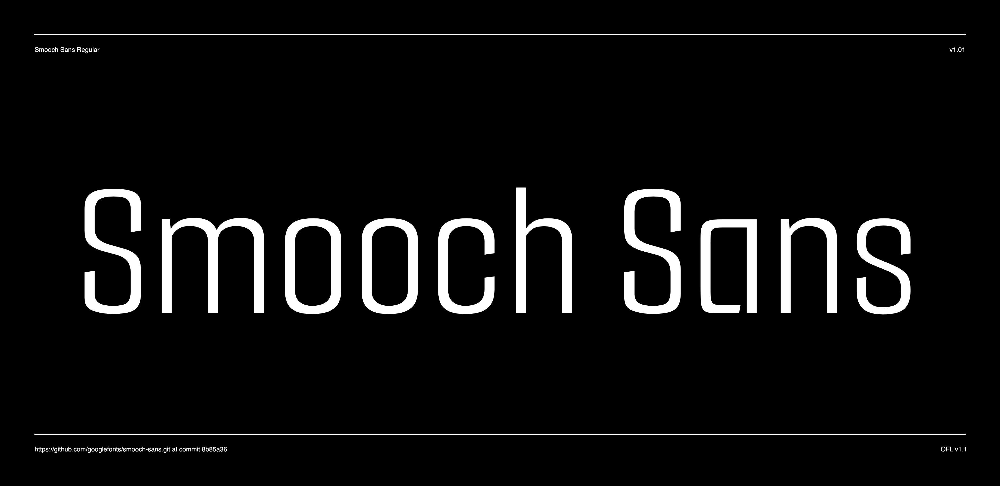

# Smooch Sans

Smooch Sans was originally designed as a truncated font to be used to compliment the Smooch brush script file. It has been updated with an extensive character set and designed as a Variable font to a offer nine weight variations of this clean sans font. 

It comes with Latin Character sets including Western, Central, and Vietnamese language support.



## Building the Fonts

The font is built using fontmake and gftools post processing script. Tools are all python based, so it must be previously installed.

To install all the Python tools into a virtualenv, do the following:

From terminal:

```

cd your/local/project/directory

#once in the project folder create a virtual environment. 
This step has to be done just once, the first time:

python3 -m venv venv

#activate the virtual environment

source venv/bin/activate

#install the required dependencies

pip install -r requirements.txt

```

Then run the this command:

```
cd sources
gftools builder config.yml
```
